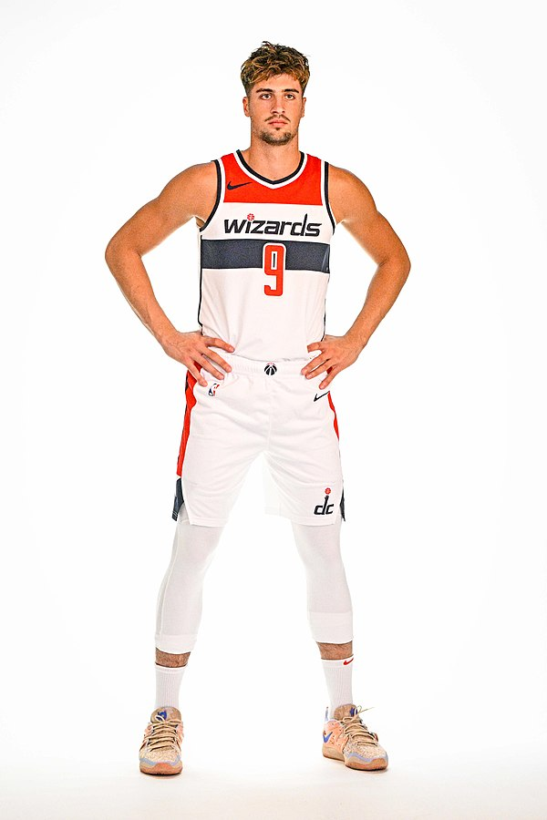

```markdown
# 🏀 Deni Avdija Stats Dashboard

Welcome to the **Deni Avdija Stats Dashboard**! This project is a web application built with Flask to showcase the latest basketball statistics of Deni Avdija.



## 📜 Table of Contents

- [Introduction](#introduction)
- [Features](#features)
- [Setup](#setup)
- [Usage](#usage)
- [Technologies Used](#technologies-used)
- [Contributing](#contributing)
- [License](#license)
- [Acknowledgements](#acknowledgements)

## 📖 Introduction

Deni Avdija Stats Dashboard provides an easy-to-use interface to view the latest statistics of the professional basketball player Deni Avdija. The application fetches data from the NBA API and displays it in a user-friendly manner.

## ✨ Features

- 📊 **View latest season stats**: Points per game, rebounds per game, assists per game, and more.
- 🎶 **Background Music**: Enjoy some tunes while browsing the stats.
- 💻 **Responsive Design**: Optimized for both desktop and mobile viewing.

## 🛠️ Setup

Follow these steps to set up the project on your local machine:

Sure, here's a well-structured and visually engaging `README.md` file for your project. It includes emojis, headlines, and detailed sections to make it appealing and informative.

```markdown
# 🏀 Deni Avdija Stats Dashboard

Welcome to the **Deni Avdija Stats Dashboard**! This project is a web application built with Flask to showcase the latest basketball statistics of Deni Avdija.


## 📜 Table of Contents

- [Introduction](#introduction)
- [Features](#features)
- [Setup](#setup)
- [Usage](#usage)
- [Technologies Used](#technologies-used)
- [Contributing](#contributing)
- [License](#license)
- [Acknowledgements](#acknowledgements)

## 📖 Introduction

Deni Avdija Stats Dashboard provides an easy-to-use interface to view the latest statistics of the professional basketball player Deni Avdija. The application fetches data from the NBA API and displays it in a user-friendly manner.

## ✨ Features

- 📊 **View latest season stats**: Points per game, rebounds per game, assists per game, and more.
- 🎶 **Background Music**: Enjoy some tunes while browsing the stats.
- 💻 **Responsive Design**: Optimized for both desktop and mobile viewing.

## 🛠️ Setup

Follow these steps to set up the project on your local machine:

1. **Clone the repository:**
   ```bash
   git clone https://github.com/Orgamliel7/Deni-Avdija-stats.git
   cd Deni-Avdija-stats
   ```

2. **Create and activate a virtual environment:**
   ```bash
   python -m venv venv
   source venv/bin/activate    # On Windows: venv\Scripts\activate
   ```

3. **Install the dependencies:**
   ```bash
   pip install -r requirements.txt
   ```

4. **Run the application:**
   ```bash
   python app.py
   ```

5. **Open your browser and visit:**
   ```
   http://127.0.0.1:5000
   ```

## 🚀 Usage

- **Home Page**: View a welcome message and click on Deni's image to start background music.
- **Stats Page**: Click on "View Statistics" to see the latest stats of Deni Avdija.

## 🧰 Technologies Used

- **Flask**: Web framework for Python
- **NBA API**: To fetch Deni Avdija's stats
- **HTML/CSS**: For structuring and styling the web pages
- **JavaScript**: To handle dynamic content and audio playback

## 🤝 Contributing

Contributions are welcome! Please follow these steps to contribute:

1. **Fork the repository**
2. **Create a new branch:**
   ```bash
   git checkout -b my-feature-branch
   ```
3. **Make your changes and commit them:**
   ```bash
   git commit -m "Add some feature"
   ```
4. **Push to the branch:**
   ```bash
   git push origin my-feature-branch
   ```
5. **Create a pull request**

## 📜 License

This project is licensed under the MIT License. See the [LICENSE](LICENSE) file for details.

## 🙏 Acknowledgements

- **NBA API**: For providing the data.
- **Flask**: For making web development in Python simple and fun.
- **OpenAI**: For the amazing assistance in building this project.

---

Feel free to explore the project, contribute, and give feedback. Enjoy the stats and the music! 🎶
```

This `README.md` file is designed to be informative and visually appealing, helping users and contributors understand the project quickly and easily.
   ```bash
   git clone https://github.com/Orgamliel7/Deni-Avdija-stats.git
   cd Deni-Avdija-stats
   ```

2. **Create and activate a virtual environment:**
   ```bash
   python -m venv venv
   source venv/bin/activate    # On Windows: venv\Scripts\activate
   ```

3. **Install the dependencies:**
   ```bash
   pip install -r requirements.txt
   ```

4. **Run the application:**
   ```bash
   python app.py
   ```

5. **Open your browser and visit:**
   ```
   http://127.0.0.1:5000
   ```

## 🚀 Usage

- **Home Page**: View a welcome message and click on Deni's image to start background music.
- **Stats Page**: Click on "View Statistics" to see the latest stats of Deni Avdija.

## 🧰 Technologies Used

- **Flask**: Web framework for Python
- **NBA API**: To fetch Deni Avdija's stats
- **HTML/CSS**: For structuring and styling the web pages
- **JavaScript**: To handle dynamic content and audio playback

## 🤝 Contributing

Contributions are welcome! Please follow these steps to contribute:

1. **Fork the repository**
2. **Create a new branch:**
   ```bash
   git checkout -b my-feature-branch
   ```
3. **Make your changes and commit them:**
   ```bash
   git commit -m "Add some feature"
   ```
4. **Push to the branch:**
   ```bash
   git push origin my-feature-branch
   ```
5. **Create a pull request**

## 📜 License

This project is licensed under the MIT License. See the [LICENSE](LICENSE) file for details.

## 🙏 Acknowledgements

- **NBA API**: For providing the data.
- **Flask**: For making web development in Python simple and fun.

---

Feel free to explore the project, contribute, and give feedback. Enjoy the stats and the music! 🎶
```
